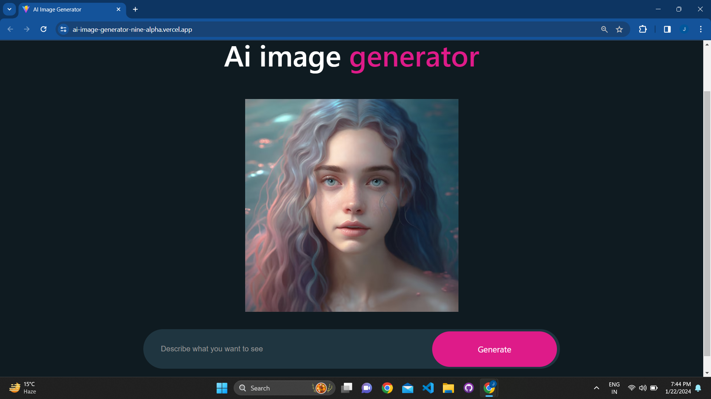

# AI Image Generator



## Overview

Welcome to the AI Image Generator repository! This image generator app is built with React and Vite, featuring OpenAI integration for creative image generation. Users can describe what they want to see, and the app uses OpenAI's powerful model to generate unique images.

## Features

- **OpenAI Integration:** Utilizes OpenAI's cutting-edge models for image generation.
- **User-Friendly Interface:** Simple and intuitive interface for users to describe and generate images.
- **Creative Outputs:** Generates diverse and imaginative images based on user input.

## Installation

1. Clone the repository:

   ```bash
   git clone https://github.com/jyotimanglani/ai-image-generator.git

2. Navigate to the project directory:

    ```bash
    cd ai-image-generator

3. Install dependencies using npm:

   ```bash
   npm install

4. Run the app:

   ```bash
   npm run dev

  The app will be available at http://localhost:3000

## Usage

Open the app in your browser.
Describe the image you want to generate in the provided input field.
Click the "Generate" button.
Witness the AI magic as the app generates a unique image based on your description.
